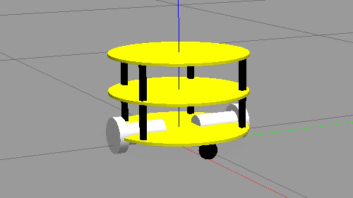
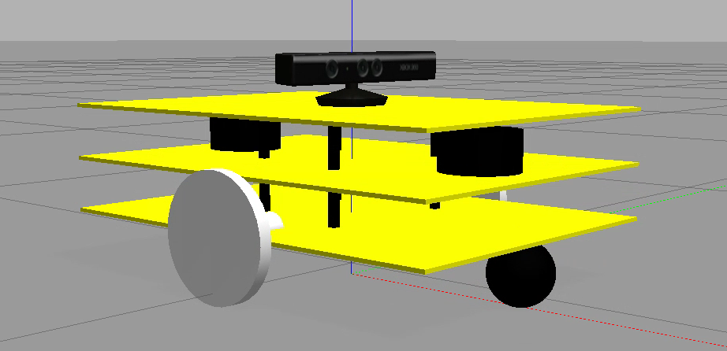
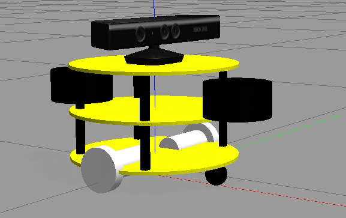
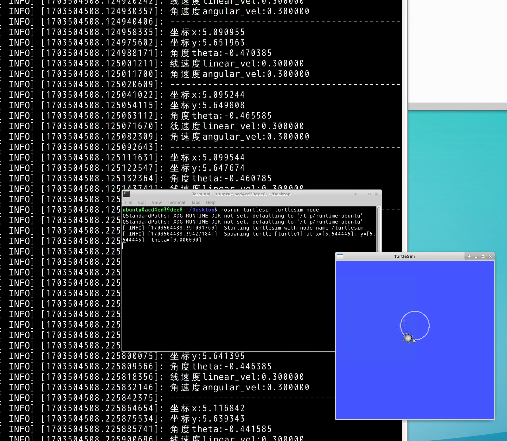
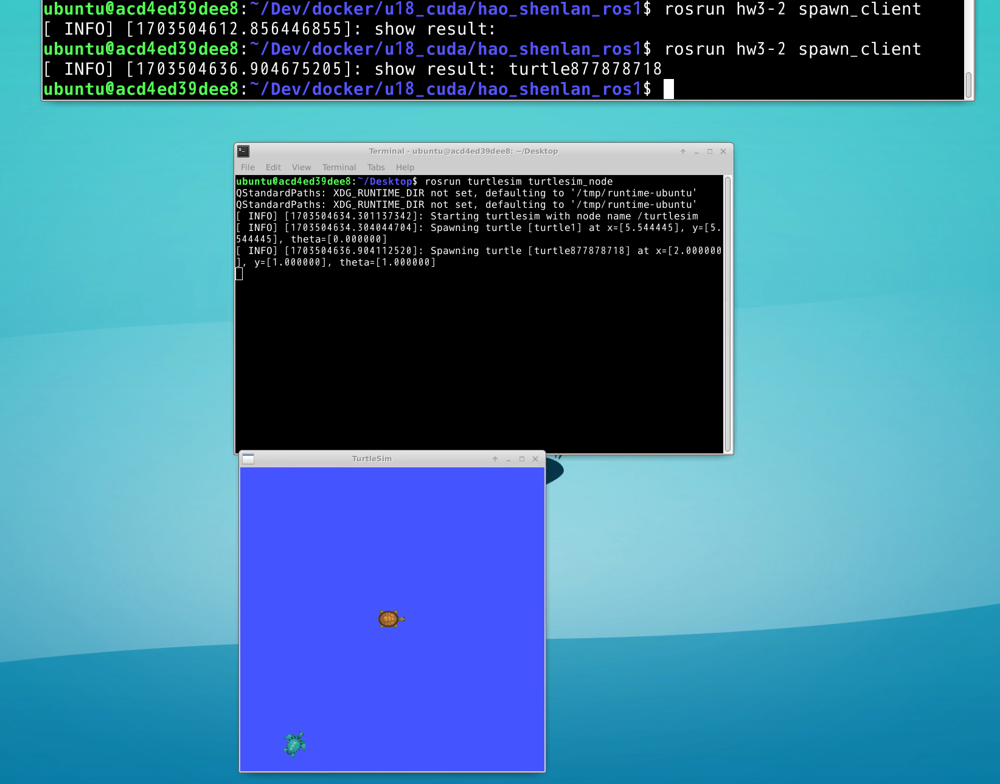
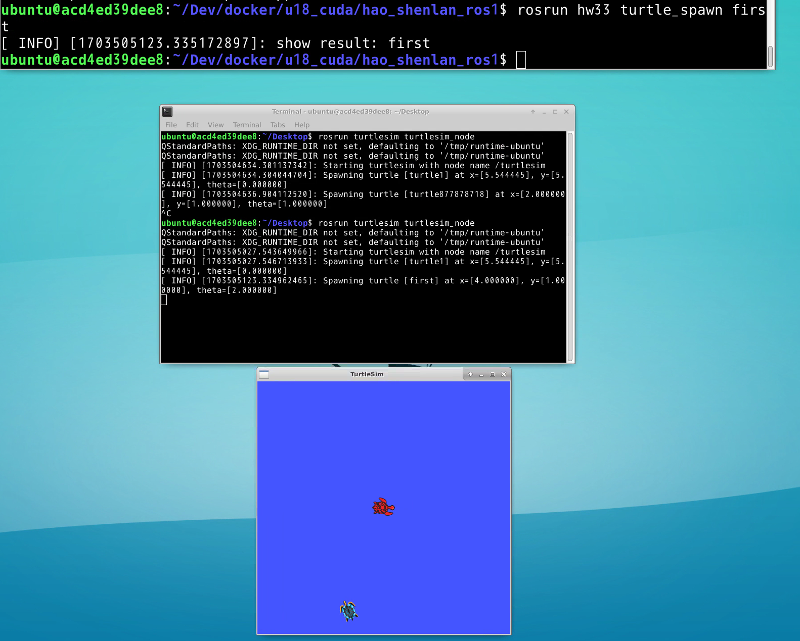
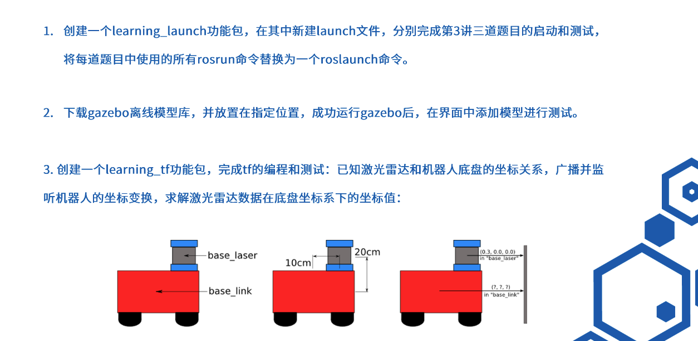
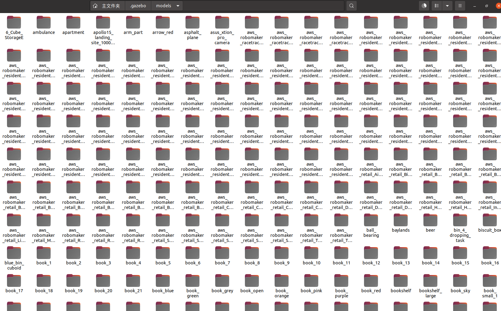
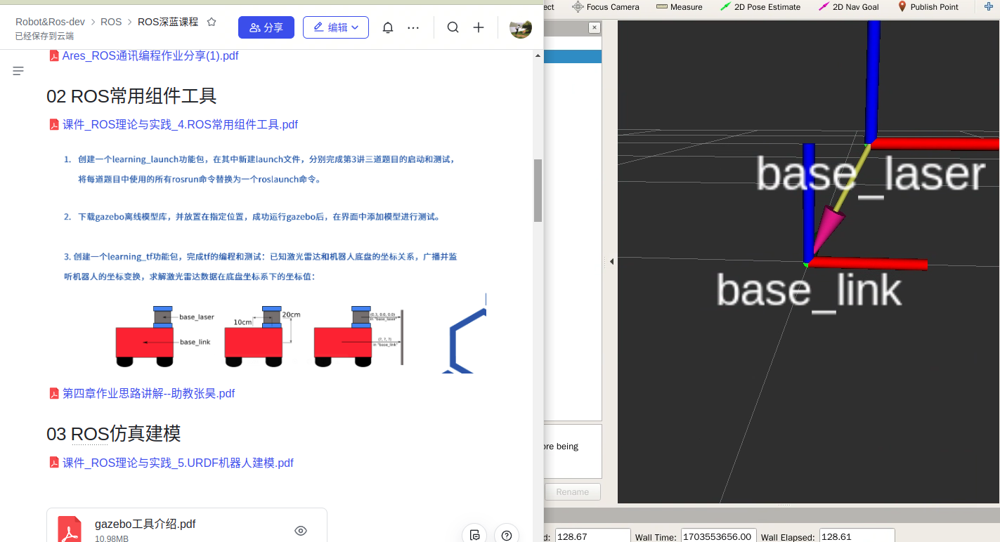
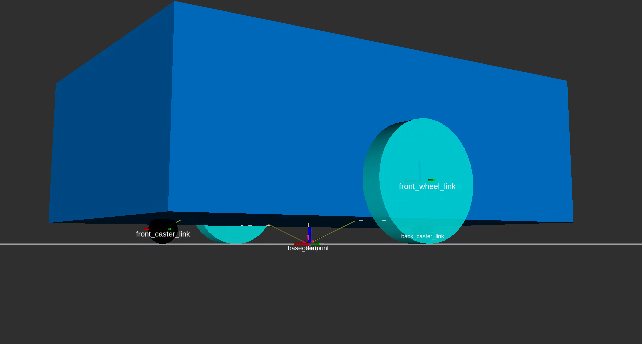

<!--
 * @Author: zhanghao
 * @Date: 2022-08-10 18:47:29
 * @LastEditTime: 2024-01-02 10:15:13
 * @FilePath: /hao_shenlan_ros1/README.md
 * @Description:  
-->
# hao_shenlan_ros1
knowledge &  homework
## 01 hao_communication
```
roslaunch hao_communication hao_communication.launch
```
## 02 hao_common
```
roslaunch hao_common tf_demo.launch
```

## 03 gazebo
```
cd .gazebo/models
git clone https://github.com/haohaoalt/gazebo_models.git
```
`open gazebo & add Path`
roslaunch hao_gazebo slamopto.launch


roslaunch hao_gazebo slamopto_gazebo.launch 






## 05 URDF


## hw2 

see pdf

## hw3

### hw3-1

```
rosrun turtlesim turtlesim_node
rosrun hw3-1 vel_pose
```

### hw3-2
```
rosrun turtlesim turtlesim_node
rosrun hw3-2 spawn_client
```

### hw3-3
rosrun hw33 turtle_spawn first

rosrun hw33 motion_server
rosrun hw33 circular_motion first begin 1.0 1.0
## hw4
### hw4-1

roslaunch hw4-1 chapter3_1.launch 
roslaunch hw4-1 chapter3_2.launch 
roslaunch hw4-1 chapter3_3_1.launch 
roslaunch hw4-1 chapter3_3_2.launch 
### hw4-2
简单使用gazebo，模型已整理好。下载后放入.gazebo/models即可。

### hw4-3 

roslaunch hw4-3 chapter4-2.launch 
rviz and add tf
## hw5

roslaunch hw5 display_mbot.launch 

## hw6
作业


roslaunch hw6 display_mbot1.launch 



## hw7


## hw8


## hw9

## hw10

## hw11
